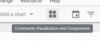

# gds-sequences-viz


   
Visualize Google Analytics top paths data in Google Datastudio (GDS).  
This experimental visualization done with d3.js (v5) and inpired by many  
examples in blockbuilder.org and   
especially this https://blockbuilder.org/63anp3ca/578bd52d368d452f64ab08d10a5f1a49  

Live demo of viz: https://datastudio.google.com/open/18WWPPOz6SF--NEVVBkwQEC0CK3EDZ-Lu  
Component ID: gs://path-sequence-viz  
Development version: gs://path-sequence-viz/dev  

In GDS you can choose upto 2 metrics (goals) to be visualized in sequence paths.  
The dimension currently works only with GA's format where sequences are separated with `" > "`  
(see the live demo)

You can use it with your own data, just add the Component ID  

 

and enable 'Community visualizations access' in your data source  

## Build and deploy

modify the manifest.json (bucket url etc) and run:  
```npm run build:prod``` (prod|dev) to create bundled js file.  
It also copies css and manifest.json to respective folder.

build and upload files to gs bucket:  
```npm run deploy:prod```  (prod|dev)

## Recent changes

- added style configurations: base font, font-size  
- color schemes selection added  
- fixed suboptimal size (svg width and height)  
- added legend toggle to style configuration
- build scripts for development and production added  

## TODO

- add option to select depth of paths to be shown (now fixed to 6 plus end node)  
- add option to select sequence separator